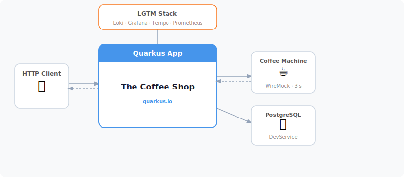
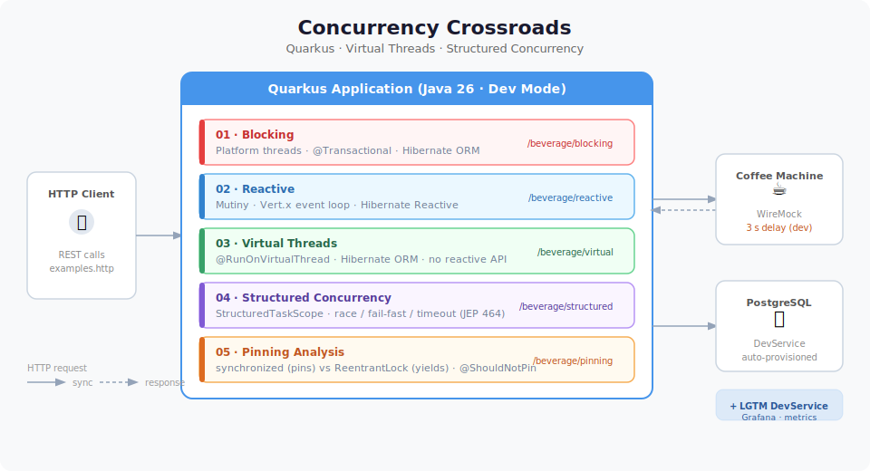

# Concurrency Crossroads: Reactive vs Virtual Threads

A Quarkus demo exploring five concurrency models through a single domain: **The Coffee Shop** — a REST API where bartenders brew coffee (a slow HTTP call) and persist the result to a database.



Each approach uses the same business logic so the trade-offs are immediately comparable.

---

## Prerequisites

| Requirement | Version |
|---|---|
| JDK | 26 Early Access ([download](https://jdk.java.net/26/)) |
| Docker or Podman | running |
| Maven | bundled via `./mvnw` |

> **Why Java 26 EA?** Structured Concurrency (`StructuredTaskScope`) is a preview feature that requires `--enable-preview`. Everything else works on Java 21+.

All external dependencies (PostgreSQL, WireMock, Grafana/LGTM) are started automatically as **DevServices** when you run in dev mode — no manual setup required.

---

## Running

```shell
./mvnw quarkus:dev
```

- App: <http://localhost:8080>
- Dev UI: <http://localhost:8080/q/dev/>
- Grafana (LGTM): check the Dev UI for the port

Use `examples.http` with your IDE HTTP client (IntelliJ, VS Code REST Client) to fire requests.

---

## The Five Approaches



### 01 · Blocking — Platform Threads

> `GET /beverage/blocking`

The traditional Java model. Each request runs on a platform (OS) thread from the Quarkus worker pool. The thread is **blocked** for the entire duration of the coffee machine call (~3 s in dev).

- Simple, familiar code — no special annotations
- Thread pool exhaustion is visible: flood the endpoint and watch requests fail once the pool is full
- Uses `@Transactional` + Hibernate ORM

| Endpoint | Description |
|---|---|
| `/beverage/blocking` | Single request |
| `/beverage/blocking/sequential` | 3 requests, one after another |
| `/beverage/blocking/parallel` | 3 requests via `ManagedExecutor` |
| `/beverage/blocking/flood?count=100` | 100 concurrent requests — shows saturation |

---

### 02 · Reactive — Mutiny + Vert.x

> `GET /beverage/reactive`

The reactive model. Requests run on the Vert.x event loop; the thread is **never blocked** — it returns immediately and a callback fires when the response arrives.

- Maximum throughput on a small number of threads
- Code complexity: nested `Uni` chains instead of straight-line code
- Uses `@WithTransaction` + Hibernate Reactive

| Endpoint | Description |
|---|---|
| `/beverage/reactive` | Single request |
| `/beverage/reactive/sequential` | 3 chained `Uni` calls |
| `/beverage/reactive/parallel` | 3 parallel `Uni` calls via `Uni.join()` |
| `/beverage/reactive/flood?count=100` | 100 concurrent requests |

---

### 03 · Virtual Threads — `@RunOnVirtualThread`

> `GET /beverage/virtual`

Virtual threads (JEP 444). Each request runs on a **virtual thread** — cheap, JVM-managed, non-blocking under the hood. The code looks identical to the blocking approach, but threads yield to the carrier during I/O instead of blocking it.

- Straight-line blocking code, reactive scalability
- Annotate the class with `@RunOnVirtualThread` — that's it
- Uses `@Transactional` + Hibernate ORM (same as blocking)

| Endpoint | Description |
|---|---|
| `/beverage/virtual` | Single request |
| `/beverage/virtual/sequential` | 3 sequential calls |
| `/beverage/virtual/parallel` | 3 parallel calls via injected `@VirtualThreads` executor |
| `/beverage/virtual/custom` | 3 parallel calls with a named custom thread factory |
| `/beverage/virtual/flood?count=100` | 100 concurrent requests — all succeed |

---

### 04 · Structured Concurrency — `StructuredTaskScope`

> `GET /beverage/structured`

Structured Concurrency (JEP 464, preview). Subtasks are **scoped to a parent task** — when the scope closes, all subtasks are guaranteed to be done or cancelled. Enables race, fail-fast, and timeout patterns without manual thread management.

- Lifetimes are explicit and safe: no orphaned threads
- Cancellation propagates automatically to sibling tasks
- Uses `StructuredTaskScope.open()` with different joiners

| Endpoint | Joiner | Description |
|---|---|---|
| `/beverage/structured/simple` | default | 3 parallel tasks, collect all |
| `/beverage/structured/custom` | `allSuccessfulOrThrow()` | Same with a named thread factory |
| `/beverage/structured/race` | `anySuccessfulOrThrow()` | First bartender to finish wins, siblings cancelled |
| `/beverage/structured/failfast` | `allSuccessfulOrThrow()` | One failure cancels everyone (uses a flakey bartender, 50% chance) |
| `/beverage/structured/timeout` | `allSuccessfulOrThrow()` + `withTimeout` | Scope cancelled after 150 ms |

---

### 05 · Pinning — `synchronized` vs `ReentrantLock`

> `GET /beverage/pinning`

Virtual threads **pin to their carrier thread** when they enter a `synchronized` block during I/O. A pinned virtual thread behaves like a platform thread — it blocks the carrier and defeats the purpose of virtual threads. `ReentrantLock` does not pin.

- `PinningBartender` uses `synchronized` → pins the carrier
- `UnpinningBartender` uses `ReentrantLock` → yields the carrier
- Tests use `@ShouldNotPin` to assert pinning behaviour
- Run with `-Djdk.tracePinnedThreads=short` (already configured) to see pinning in logs

| Endpoint | Description |
|---|---|
| `/beverage/pinning/pinned` | Single call through `synchronized` method |
| `/beverage/pinning/unpinned` | Single call through `ReentrantLock` |
| `/beverage/pinning/pinned/parallel` | 3 parallel pinned calls |
| `/beverage/pinning/unpinned/parallel` | 3 parallel unpinned calls |

---

## DevServices

Everything starts automatically in dev mode:

| Service | What it does |
|---|---|
| **PostgreSQL** | Database for all five approaches |
| **WireMock** | Mocks the coffee machine HTTP endpoint with a 3 s delay (100 ms in tests) |
| **LGTM** | Grafana + Loki + Tempo + Prometheus — metrics via Micrometer + OTel |

---

## Running Tests

```shell
./mvnw test
```

Tests use WireMock with a 100 ms delay. Virtual thread tests are annotated with `@ShouldNotPin` to assert that no unexpected carrier pinning occurs.
